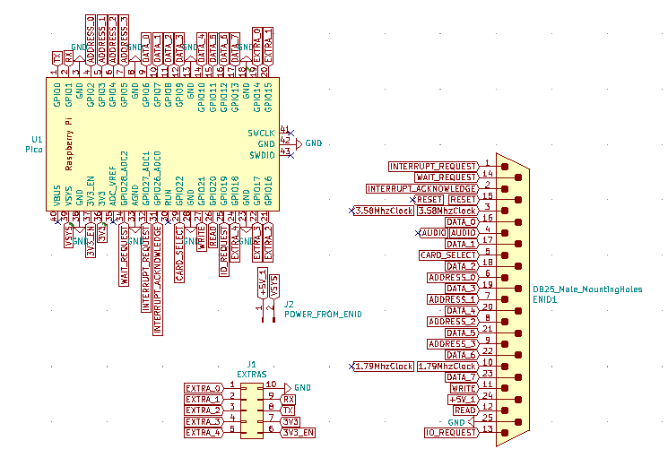

# InformationalNabuRemoteEnidPicoActiveInterfaceRelay
Allows interfacing from the NABU PC to the Raspberry Pi Pico via ENID (github.com/mackiea/ExternalNabuInterfaceDevice)

| ENID | Pico GPIO Pin | Description           |
| ---- | ------------- | -----------           |
|    1 |            27 | Interrupt Request     |
|    2 |            26 | Interrupt Acknowledge |
|    3 |      Not used | 3.58 MHz Clock        |
|    4 |      Not used | Audio                 |
|    5 |            22 | Card Select           |
|    6 |             2 | Address 0             |
|    7 |             3 | Address 1             |
|    8 |             4 | Address 2             |
|    9 |             5 | Address 3             |
|   10 |      Not used | 1.79 MHz Clock        |
|   11 |            21 | Write                 |
|   12 |            20 | Read                  |
|   13 |            19 | I/O Request           |
|   14 |            28 | Wait Request          |
|   15 |      Not Used | Reset                 |
|   16 |             6 | Data 0                |
|   17 |             7 | Data 1                |
|   18 |             8 | Data 2                |
|   19 |             9 | Data 3                |
|   20 |            10 | Data 4                |
|   21 |            11 | Data 5                |
|   22 |            12 | Data 6                |
|   23 |            13 | Data 7                |
|   24 |          VSYS | +5V Rail 1 (Switched) |
|   25 |    PCB Ground | Ground Rail 1         |
